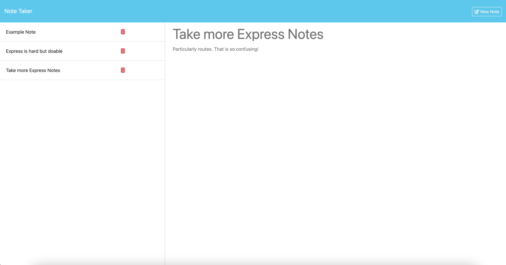

# NoteTaker-BParks

## Description
This application allows a user to create new notes, view old ones, and delete any that are no longer relevant to the user. 

## Table of Contents
- [Description](#Description)
- [How to Install](#How-to-Install)
- [How to Use](#How-to-Use)
- [Repo License](#Repo-License)
- [Contributions](#Contributions)
- [Tests Required](#Tests-Required)
- [Questions/Contact Me](#questionscontact-me))

## How to Install
First step: clone the repo. Next: open a terminal in the directory where you cloned it. After that, run "npm i". Once that is done running, you can start the application by typing "node server.js". After that, click on the link provided in the console and it will bring you to the application.

## How to Use
Type a title and a description then click the save button that appears when both inputs are populated. If you don't like what you have, you can click the clear form button and begin typing something new. After the note is saved, you can immediately add another or click on any in the list on the left to view them in further detail. Finally, when you no longer need the note, you can delete it by hitting the trashcan icon.

Alternatively you can go to this website: https://notetaker-bparks.onrender.com/notes
warning: This is not locally hosted so other users can and probably will add their own notes and delete yours because people aren't always nice. 

## Repo License
 None

 ## Screenshots
 

## Contributions
No

## Tests Required
No

## Questions/Contact Me
For additional support, contact me with questions through either of the following: 
Github: https://github.com/benjamin-parks
Email: benparks93@gmail.com